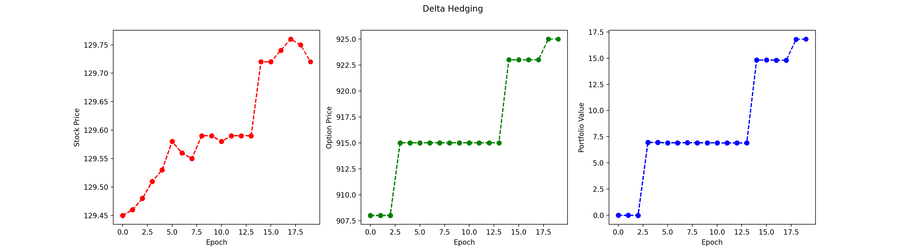

# delta-hedging

## Description:

This project models a delta-neutral portfolio for one call for a given stock and strike price. This means that is attempts to make the whole portfolio [delta](https://www.merrilledge.com/investment-products/options/learn-understand-delta-options) neutral, essentially offseting the change in price of the option with the change in price of the stock. This means that the portfolio should theoretically be resistant to changes in the stock price. However, factors like volatility, volume, etc. should still cause the portfolio's overall value to change. The portfolio will start at a value of 0, meaning it must buy/sell risk-free assets in order to counteract the costs of the call and stocks. This model utlizies the `robin_stocks` api to get stock and option data from Robinhood. 

## Features
- Modeling of Delta-Neutral portfolio containing stocks, a call, and risk-free assets
- Logs the what the model buys and sells at each time step as well as its performance
- Actively graphs the performance of the portfolio in relation to just holding the stock and call

## Installation
Clone the repository to get started.

```bash
git clone https://github.com/mbederman/delta-hedging.git
```

## Usage:

In order use this model, the `robin_stocks` api must be configured properly. This program does this through env variables which need to be set. 

```bash
RB_USERNAME: robinhood username
RB_PASSWORD: robinhood password
RB_OTP: robinhood one time password used to set up authenticators 
```

In order to set up a one time password for `RB_OTP` see `robin_stocks` [documentation](https://readthedocs.org/projects/robin-stocks/downloads/pdf/latest/).

The specific time details, stock, and option must be specified in `config.py`.

```python
# Ticker of stock and call desired
TICKER = "AAPL"

# Expiration date of call option
EXP_DATE = "2023-02-03"

# Strike price of call option
STRIKE = 124

# Interval between each portfolio adjustment in seconds
T_INT = 2

# Number of portfolio adjustments
EPOCHS = 5
```

Now, in order to run the program, run the `main.py` file.

```bash
python main.py
```

## Example Output


```Total Portfolio Value: 2.0494105249999848
(2023-02-02 15:54:55.602384) Selling -0.0016039999999999388 share of META at 182.72
(2023-02-02 15:54:55.602384) Buying 0.2930828800000427 risk free assets
(2023-02-02 15:54:55.603596) Current Portfolio: -0.586973 shares of META, -875.78376142 risk free assets, 1 of call option
Total Portfolio Value: 4.964532020000092
(2023-02-02 15:55:06.998979) Buying 0.007755999999999985 share of META at 182.3785
(2023-02-02 15:55:06.998979) Selling -1.4145276460000105 risk free assets
(2023-02-02 15:55:06.999987) Current Portfolio: -0.579217 shares of META, -877.198289066 risk free assets, 1 of call option
Total Portfolio Value: -14.835016700500091
(2023-02-02 15:55:18.531852) Selling -0.0022880000000000678 share of META at 182.38
(2023-02-02 15:55:18.531852) Buying 0.41728544000000056 risk free assets
(2023-02-02 15:55:18.533102) Current Portfolio: -0.581505 shares of META, -876.781003626 risk free assets, 1 of call option
Total Portfolio Value: -12.835885526000197
(2023-02-02 15:55:29.416936) Selling -0.0022639999999999327 share of META at 182.47
(2023-02-02 15:55:29.416936) Buying 0.4131120799999053 risk free assets
(2023-02-02 15:55:29.417465) Current Portfolio: -0.583769 shares of META, -876.3678915460001 risk free assets, 1 of call option
Total Portfolio Value: -9.88822097600007
(2023-02-02 15:55:40.872758) Selling -0.007108000000000003 share of META at 182.85
(2023-02-02 15:55:40.872758) Buying 1.29969779999999 risk free assets
(2023-02-02 15:55:40.873661) Current Portfolio: -0.590877 shares of META, -875.0681937460001 risk free assets, 1 of call option
Total Portfolio Value: 6.889946803999919
```



